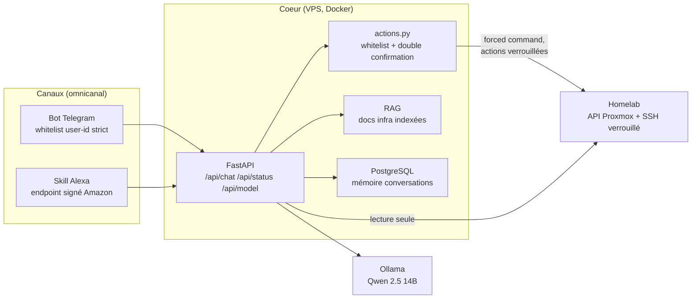

# Vektor — Capacités V1 & Limitations

> Assistant personnel auto-hébergé, style Jarvis : **Telegram + Alexa**, cerveau LLM local
> (Ollama), mémoire persistante et outillage d'infrastructure **en lecture seule par défaut**.

## Architecture en une phrase

Un bot Telegram et une Skill Alexa parlent à une API FastAPI unique, qui répond soit
**instantanément** avec des données live (sans LLM), soit interroge **Qwen 2.5 14B** via
Ollama, enrichi du contexte RAG et de l'historique de conversation.

## Ce que Vektor sait faire (V1)

### État de l'infrastructure en temps réel
- CPU, RAM, swap, uptime et charge du nœud Proxmox
- Liste complète des conteneurs LXC : état, RAM, uptime
- Stockages Proxmox : occupé/libre par volume (alerte visuelle au-delà de 90 %)
- Inventaire Docker de tous les conteneurs (via un canal SSH lecture seule)
- Statut HTTP des services surveillés (Jellyfin, Sonarr, Radarr, Prowlarr, qBittorrent, Garmin Map)

### Assistant de vie quotidienne
- Questions générales en français (le modèle répond avec ses connaissances propres)
- Mémoire de conversation persistante (PostgreSQL) partagée entre Telegram et Alexa
- Historique contextuel (les 8 derniers échanges) envoyé au modèle à chaque tour
- Commande `/forget` : efface toute la mémoire d'un utilisateur

### Commandes Telegram
| Commande | Effet |
|---|---|
| `/status` | Rapport complet de l'infrastructure, généré en direct (sans LLM) |
| `/model` | Fiche technique réelle : modèle, matériel, latence moyenne mesurée |
| `/seeds` | Top torrents en seeding, ratios, espace de staging récupérable |
| `/forget` | Réinitialise la mémoire de conversation |
| `/start`, `/help` | Onboarding et liste des commandes |

### Actions d'écriture (sécurisées)
Un flux strict en deux temps, impossible à contourner :
1. **Détection** : la demande correspond à une action de la whitelist (expressions régulières)
2. **Proposition** : Vektor annonce l'action et attend un `OUI` explicite (expire après 120 s)

Actions disponibles : redémarrage d'un CT LXC, redémarrage d'un conteneur Docker
(services critiques comme DNS ou authentification **blacklistés**), rescan de bibliothèque
Sonarr/Radarr, pause/reprise globale de qBittorrent.

### Sécurité (conçue pour l'exposition publique)
- Telegram : **whitelist stricte par user-id** — personne d'autre ne peut parler au bot
- Alexa : vérification des requêtes Amazon, endpoint derrière reverse proxy HTTPS
- API : authentification par token (`X-Vektor-Token`)
- SSH vers l'hyperviseur : **forced command** — la clé n'exécute qu'un script fermé,
  aucune commande libre ; canaux distincts lecture (`vektor-status`) et écriture (`vektor-actions`)
- LLM : prompt système interdisant la révélation de secrets et les actions non confirmées

## Ce que Vektor ne sait PAS faire (limitations V1)

- **Pas d'agent autonome** : pas d'exécution de tool-calls par le LLM, pas de planification
  multi-étapes (LangGraph est présent mais le graphe est trivial). Le routage vers les
  données live est un routeur par mots-clés, pas une décision du modèle.
- **Whitelist d'actions fermée** : une action hors liste (ex. "éteint le serveur") est
  refusée, c'est voulu.
- **RAG basique** : une seule source de documentation, découpage simple, pas de
  re-ranking ni de détection de "la doc ne répond pas".
- **Pas de voix locale** : l'écoute continue (wake-word local, STT/TTS maison) est hors
  périmètre V1 ; Alexa reste le seul canal vocal.
- **Modèle 14B quantifié** : raisonnement limité sur les questions complexes, réponses
  parfois lentes (voir latences), risque d'hallucination sur les faits récents.
- **Vocable français uniquement** : les patterns d'actions et le prompt sont en français.
- **Mono-utilisateur assumé** : la whitelist est conçue pour un propriétaire (+ invités
  explicites), pas pour un usage multi-tenant.

## Latences mesurées (VPS 24 GB RAM, CPU seul)

| Type de question | Chemin | Latence |
|---|---|---|
| "état des CTs", "stockage libre" (donnée live) | routeur → API Proxmox, **sans LLM** | **< 1 s** |
| Question générale courte | Ollama Qwen 2.5 14B | 7 – 15 s |
| Question complexe / longue réponse | Ollama Qwen 2.5 14B | 15 – 60 s |
| Modèle chargé en RAM (keep_alive 2 h) | évite le chargement à froid (~10 s) | — |

## Comment poser les bonnes questions

- Données infra : "**quel est le stockage libre sur le PVE ?**", "**état des CTs**",
  "**montre les conteneurs docker**" → réponse instantanée chiffrée
- Généralistes : "résume X en une phrase", "c'est quoi Y" → passage par le LLM
- Actions : "mets les téléchargements en pause" → proposition, puis répondre `OUI`
- Plus la question est précise (nom de service, CT, mot d'état), plus Vektor répond vite
  et juste : les questions vagues partent au LLM avec le contexte disponible.
