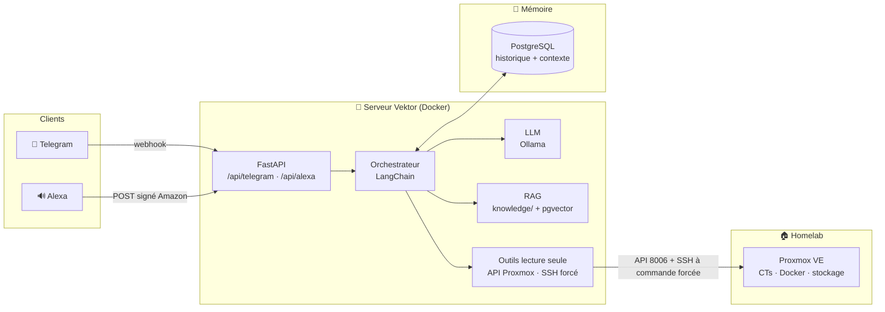

# Vektor


Assistant personnel auto-hébergé « Jarvis » : omnicanal **Telegram + Alexa**,
mémoire conversationnelle PostgreSQL, RAG sur la documentation
d'infrastructure et **outils live en lecture seule** (Proxmox, Docker,
services). Cerveau : Ollama résident à la demande sur ton serveur.

## Architecture



> 📖 **Journal complet du déploiement, problème par problème :
> [DEPLOIEMENT-V1.md](DEPLOIEMENT-V1.md)**

## Capacités V1

- Telegram : `/start` `/help` `/status` `/model` `/seeds` `/forget` + chat libre (whitelist stricte)
- Alexa : endpoint HTTPS (ex. `https://vektor.example.ch/api/alexa`) avec vérification cryptographique
  Amazon complète, réponses progressives, multi-tour partagé avec Telegram)
- Rapport homelab live en 0,1 s sans LLM (état PVE, CTs, Docker, stockage, services)
- `/seeds` : top 10 torrents en seed par ratio (qBittorrent live) + espace staging
  récupérable (fichiers non hardlinkés, calculé côté PVE et mis en cache 24 h —
  le premier scan tourne en arrière-plan, réponse toujours immédiate)
- Questions générales via le LLM ; les données live ne sont **jamais** déformées
  par le modèle (renvoyées telles quelles)
- Actions d'écriture **à double confirmation** (proposition → `OUI` explicite,
  TTL 2 min) : redémarrage Jellyfin, redémarrage Tdarr, redémarrage d'un LXC,
  rescan de bibliothèque Sonarr/Radarr, pause/reprise globale qBittorrent
- Sécurité : lecture seule par défaut, aucun shell générique, SSH à commande forcée
  avec whitelist fermée (les 7 actions ci-dessus sont les seules exécutables),
  secrets hors Git, API non exposée publiquement

## Déploiement

1. Copier `.env.example` vers `.env`.
2. Générer un mot de passe PostgreSQL et un token API aléatoire.
3. Renseigner `POSTGRES_PASSWORD`, `VEKTOR_API_TOKEN`, le modèle Ollama et la whitelist Telegram.
4. Lancer `docker compose up -d --build`.
5. Vérifier `curl http://127.0.0.1:8092/health`.
6. Activer le profil Telegram uniquement après création d’un bot dédié :

```bash
docker compose --profile telegram up -d telegram
```

## Règles

- Ne jamais mettre `.env` dans Git.
- Ne pas réutiliser le token du bot d’administration existant.
- Toute action mutante nécessite une future étape de confirmation dédiée.
- Le RAG fournit un contexte documentaire, mais les états sont vérifiés live.
- Les secrets et clés privées sont exclus de `knowledge/`.

## Canaux Proxmox lecture seule (installés)

- **API PVE** : token dédié `vektor-ro@pve!vektor` (rôle PVEAuditor, `privsep 0` pour hériter du rôle). Sources : node (CPU, RAM, swap, uptime), CTs, stockages.
- **Canal SSH à commande forcée** : clé ed25519 dédiée dont la ligne `authorized_keys` impose `command="/usr/local/bin/vektor-status"` + `no-pty,no-port-forwarding`. Le script statique sur le PVE renvoie CTs + inventaire Docker + pression mémoire (`memory.peak`), et dispatche `vektor-status seeds` vers le rapport de seeding (lecture seule : stats qBittorrent + cache staging). La clé ne peut exécuter AUCUNE autre commande (testé : une commande arbitraire est silencieusement remplacée par le script).
- Montage `./secrets:/app/secrets:ro`, clé possédée par l uid du conteneur (10001).

## Prochaine étape

Ajouter backups, DNS et monitoring en lecture seule via API avec des credentials dédiés aux permissions minimales. Ne jamais ajouter un outil shell générique.
