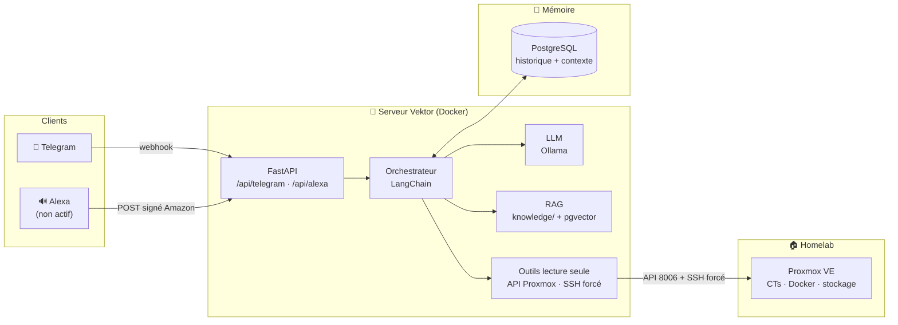

# Vektor


Assistant personnel auto-hébergé « Jarvis » : **canal Telegram en production**, canal
Alexa développé côté serveur mais pas encore activé sur l'appareil (voir
[DEPLOIEMENT-V1.md](DEPLOIEMENT-V1.md)), mémoire conversationnelle PostgreSQL, RAG sur
la documentation d'infrastructure et **outils live en lecture seule** (Proxmox, Docker,
services). Cerveau : **Qwen 2.5 14B** via Ollama, entièrement auto-hébergé.

## 🎯 Vektor en bref

Vektor est un assistant personnel auto-hébergé qui répond sur Telegram (le canal
vocal Alexa est construit mais pas encore opérationnel sur l'Echo). **Il est capable de** : fournir l'état réel d'une
infrastructure en moins d'une seconde (CPU, RAM, stockage, conteneurs, services,
torrents) sans jamais passer par le LLM pour les chiffres, répondre aux questions
générales avec un LLM local enrichi d'une documentation indexée (RAG) et de la
mémoire des conversations passées, et exécuter quelques actions d'administration
(redémarrages, rescans, pause des téléchargements) toujours après une double
confirmation explicite. **Il n'est pas capable de** : agir en agent autonome (le
LLM ne décide rien ni n'exécute rien lui-même), faire une action hors de sa
whitelist fermée, écouter en continu hors Alexa, ni servir plusieurs
utilisateurs (whitelist stricte, mono-utilisateur). C'est un assistant fiable
et verrouillé, pas une IA omnipotente — un choix de sécurité assumé.

> 📖 **Détail complet des capacités, limitations et latences mesurées :
> [CAPACITES-V1.md](CAPACITES-V1.md)** — journal du déploiement problème par
> problème : [DEPLOIEMENT-V1.md](DEPLOIEMENT-V1.md)

## Architecture



## Capacités V1

### Deux chemins de réponse : live ou LLM

| Type de question | Chemin | Latence mesurée |
|---|---|---|
| Donnée infra chiffrée ("état des CTs", "stockage libre", "quel/combien/montre…") | routeur → API Proxmox / SSH lecture seule, **sans LLM** | **< 1 s** |
| Question générale courte | Ollama Qwen 2.5 14B | 7 – 15 s |
| Question complexe / réponse longue | Ollama Qwen 2.5 14B | 15 – 60 s |

Les données live ne sont **jamais** déformées par le modèle : elles sont
renvoyées telles quelles. Le modèle reste chargé en RAM 2 h (`keep_alive`)
pour éviter le démarrage à froid.

### Ce qu'il sait faire

- **Infrastructure en temps réel** : CPU/RAM/swap/uptime du nœud Proxmox, liste
  des CTs (état, RAM, uptime), stockages (alerte au-delà de 90 %), inventaire
  Docker de tous les conteneurs, statut HTTP des services (Jellyfin, Sonarr,
  Radarr, Prowlarr, qBittorrent, Garmin Map)
- **Vie quotidienne** : questions générales en français, mémoire de conversation
  persistante (PostgreSQL), `/forget` pour tout effacer
- **Commandes Telegram** : `/status` (rapport infra complet, sans LLM),
  `/model` (fiche technique réelle : modèle, matériel, latence moyenne),
  `/seeds` (top torrents en seed + espace staging récupérable), `/forget`,
  `/start`, `/help` + chat libre
- **Actions d'écriture à double confirmation** (proposition → `OUI` explicite,
  TTL 2 min) : redémarrage Jellyfin, redémarrage Tdarr, redémarrage d'un LXC,
  redémarrage d'un conteneur Docker, rescan de bibliothèque Sonarr/Radarr,
  pause/reprise globale qBittorrent

### Ce qu'il ne peut pas faire (choix de conception)

- Pas d'agent autonome : le LLM ne choisit ni n'exécute d'outils, le routage
  vers les données live est déterministe (mots-clés), pas une décision du modèle
- Whitelist d'actions fermée : "éteins le serveur" ou toute action hors liste
  est refusée — voulu
- Pas de voix opérationnelle : le canal Alexa (skill + serveur) est développé et
  validé dans le simulateur Amazon, mais l'Echo physique ne déclenche pas encore la
  skill — Telegram reste le seul canal réellement utilisé
- Français uniquement, mono-utilisateur assumé
- Modèle 14B quantifié : raisonnement limité sur les sujets complexes, faits
  récents susceptibles d'hallucination

## Déploiement

1. Copier `.env.example` vers `.env` (variables documentées dans le fichier).
2. Générer un mot de passe PostgreSQL et un token API aléatoire.
3. Renseigner `POSTGRES_PASSWORD`, `VEKTOR_API_TOKEN`, le modèle Ollama et la
   whitelist Telegram (user-ids autorisés, séparés par des virgules).
4. Lancer la stack :

```bash
docker compose up -d --build
```

5. Vérifier la santé :

```bash
curl http://127.0.0.1:8092/health
```

6. Activer le profil Telegram après création d'un bot dédié (BotFather) :

```bash
docker compose --profile telegram up -d telegram
```

Le code du canal Alexa est inclus (endpoint `https://<domaine>/api/alexa`, vérification
cryptographique Amazon complète : signature, horizon temporel, skill ID) et a été validé
dans le simulateur Amazon ; l'intégration sur appareil physique reste à finaliser —
interaction model, démarche et blocage rencontré détaillés dans
[DEPLOIEMENT-V1.md](DEPLOIEMENT-V1.md).

## Sécurité

- Telegram : **whitelist stricte par user-id** — personne d'autre ne peut parler au bot
- Alexa : vérification complète des requêtes Amazon, endpoint derrière HTTPS
- API interne : authentification par token (`X-Vektor-Token`), non exposée publiquement
- SSH vers l'hyperviseur : **forced command** — la clé n'exécute qu'un script
  fermé (`vektor-status` en lecture, `vektor-actions` en écriture), aucune
  commande libre possible ; les 7 actions de la whitelist sont les seules
  exécutables, les services critiques (DNS, auth) sont blacklistés
- Secrets hors Git (`secrets/` monté en lecture seule), prompt système
  interdisant la révélation de secrets au LLM
- Canaux Proxmox : API en lecture seule (token dédié, rôle PVEAuditor)

## Règles

- `.env` ne doit jamais être commité.
- Le token du bot ne doit pas être réutilisé depuis un bot d'administration existant.
- Le RAG fournit un contexte documentaire ; les états sont vérifiés en direct.
- Les secrets et clés privées sont exclus de `knowledge/`.

## Prochaines étapes (V2)

- Tool-calling natif (LangChain `bind_tools`) pour que le LLM choisisse lui-même
  quand interroger l'infra, au lieu du routeur par mots-clés
- RAG enrichi : plusieurs sources, re-ranking, détection « la doc ne répond pas »
- Écoute continue locale (wake-word openWakeWord + Whisper + Piper sur Raspberry Pi)
- Backups, DNS et monitoring en lecture seule via API avec credentials dédiés
  aux permissions minimales — jamais d'outil shell générique
